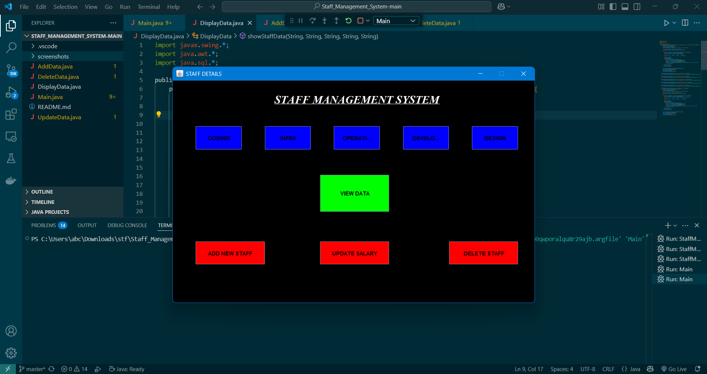
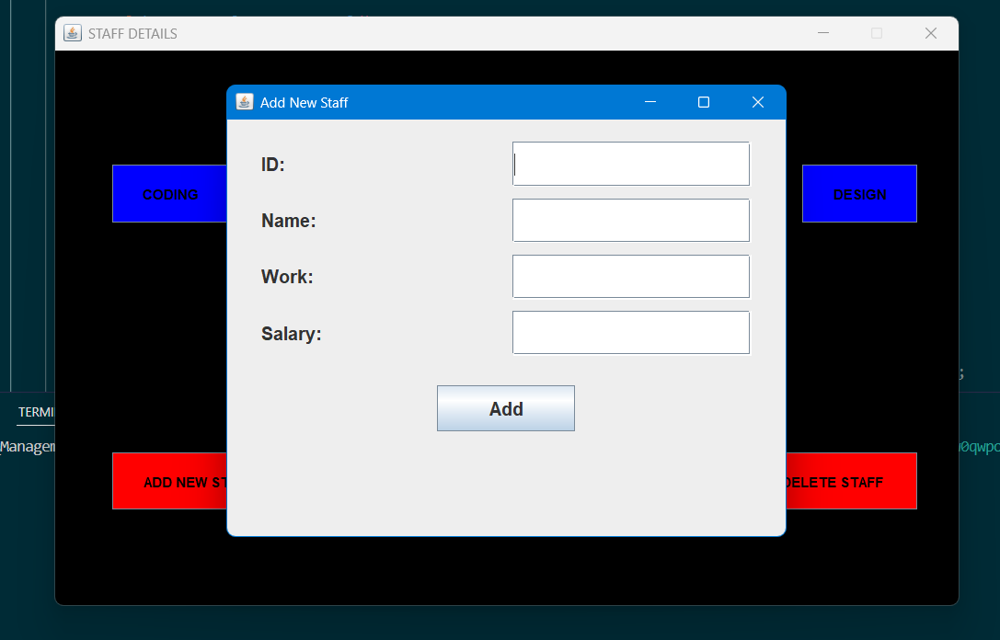

# Staff Management System


A comprehensive Java Swing application for managing staff information with MySQL database integration.

## Features

- **Department-wise Staff Viewing**
  - Coding
  - Infrastructure
  - Operations
  - Development
  - Design
- **CRUD Operations**
  - Add new staff members
  - Update staff salaries
  - Delete staff records
  - View all staff data
- **User-Friendly Interface**
  - Clean, intuitive GUI
  - Responsive design
  - Data displayed in formatted tables

## Screenshots


*Main application interface*


*Add new staff member form*

### Prerequisites
```bash
# Install Java JDK 17+
sudo apt install openjdk-17-jdk

# Install MySQL Server 8.0+
sudo apt install mysql-server

# Verify installations
java -version
mysql --version

#Database Setup

-- Create database
CREATE DATABASE test;

-- Use the database
USE test;

-- Create staff table
CREATE TABLE rog (
    id INT PRIMARY KEY,
    name VARCHAR(100),
    work VARCHAR(50),
    salary INT
);

-- Sample data (optional)
INSERT INTO rog VALUES 
(1, 'John Doe', 'Coding', 75000),
(2, 'Jane Smith', 'Infra', 65000),
(3, 'Mike Johnson', 'Operations', 60000);

```

# Configuration

// Update these connection details in StaffManagementGUI.java if needed

String url = "jdbc:mysql://localhost:3306/test";

String user = "root";

String password = "examplepassword"; // Change to your MySQL password

# Running the Application

javac Main.java

java Main


# Dependencies

Add MySQL Connector/J to your project (download from https://dev.mysql.com/downloads/connector/j/)

#### If compiling with MySQL Connector

javac -cp .:mysql-connector-java-8.0.28.jar StaffManagementGUI.java

java -cp .:mysql-connector-java-8.0.28.jar StaffManagementGUI


# Contact

### Gudala Sambasiva - sambasivagudala13@gmail.com

### Project Link: https://github.com/sambasivagudala369/Staff_Management_System

